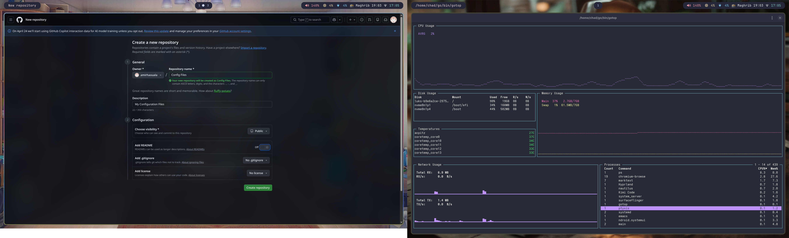
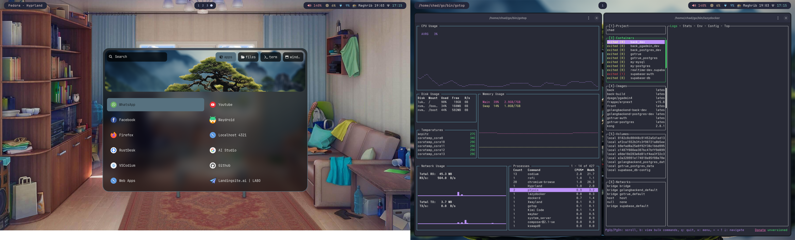
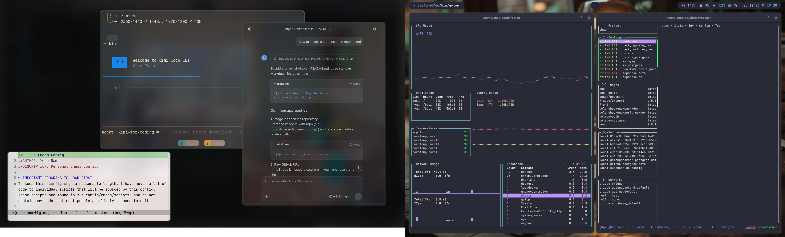
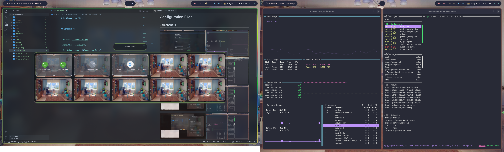
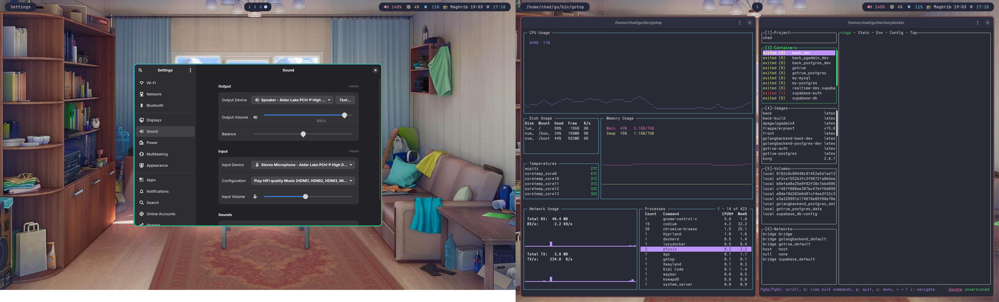
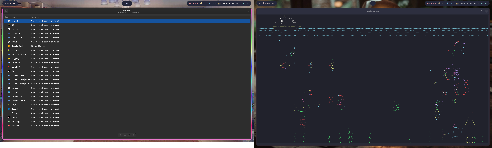

# Configuration Files

## Screenshots

## Web Apps

## Termbin

[Installed](Installed.txt)

## dnf copr list

- copr.fedorainfracloud.org/errornointernet/packages
- copr.fedorainfracloud.org/kylegospo/webapp-manager
- copr.fedorainfracloud.org/phracek/PyCharm (disabled)
- copr.fedorainfracloud.org/solopasha/hyprlandqemu

## Vscodiun Setup

[VSCodium](VSCodium)

## Other OSES

- Distrobox: Arch
- Podman: Parrot, Kali
- Boxes(libvirt): Nixos
