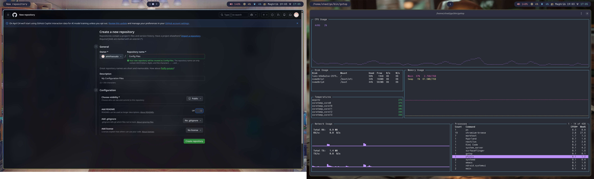
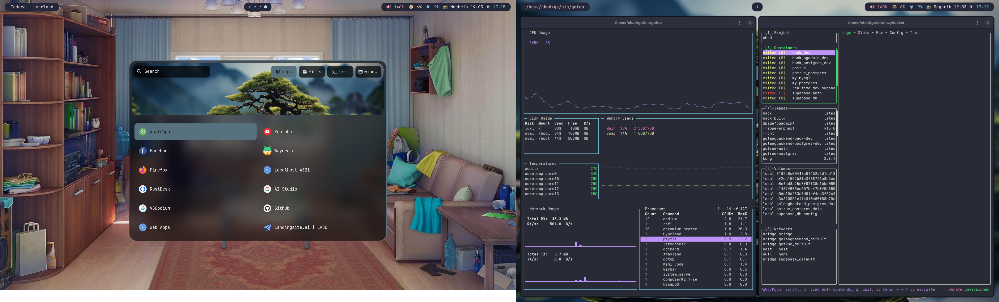
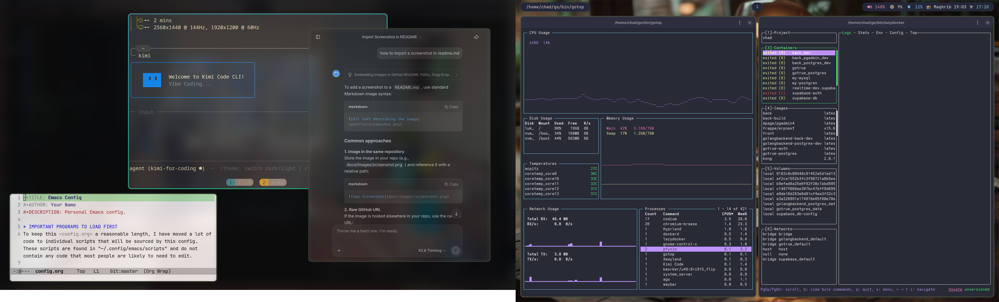
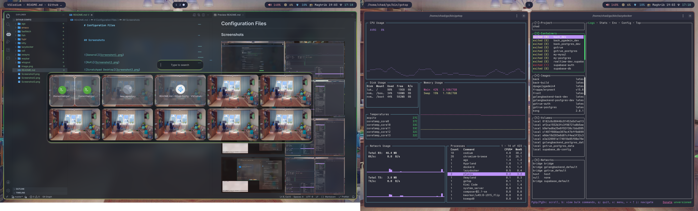
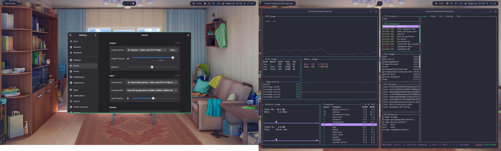
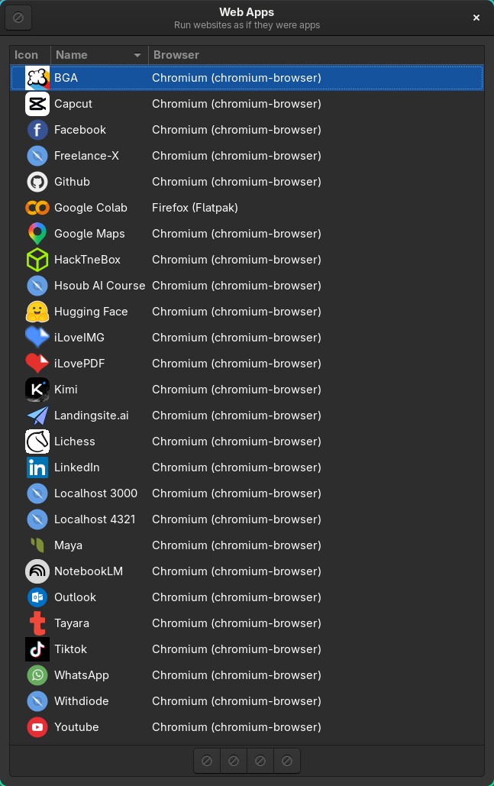
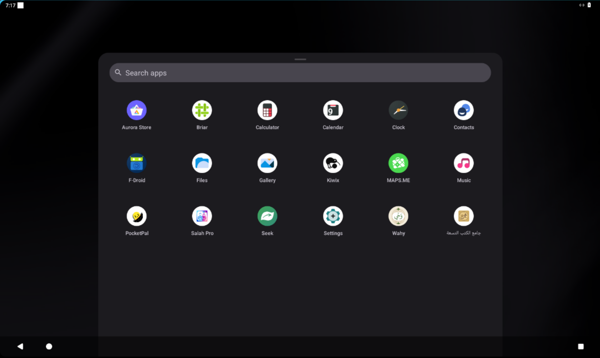

# CONFIGURATION FILES

## Fedora Manual Post-install setup

- [Post-Install](https://github.com/amirhaouala/Post-Install)

## WHAT'S INCLUDED

- Installed application including flatpak (I'll exclude fedora installed apps)
- Screenshots
- Ags configuration
- Emacs configuration
- Fastfetch configuration
- Fish configuration
- HYPR Configuration (Special thanks to JaKooLit)
- Kitty configuration
- Lazydocker configuration
- Rofi configuration
- Swaync configuration
- VSCode configuration
- Waybar configuration
- Wlogout configuration
- Bash configuration
- Tmux configuration
- Aliases

## SCREENSHOTS

## VSCODE SETUP

[VSCodium](VSCodium)

## INSTALLED APPS ON FEDORA

[Installed](Installed.txt)
[Flatpak](Flatpaks.txt)

## WAYBAR PRAYER SCRIPT TO BUILD

- [PRAYERBAR](https://github.com/Onizuka893/prayerbar)

## DNF COPR LIST

- copr.fedorainfracloud.org/errornointernet/packages
- copr.fedorainfracloud.org/kylegospo/webapp-manager
- copr.fedorainfracloud.org/solopasha/hyprlandqemu

## OTHER OSES

- Distrobox: Arch
- Podman: Parrot, Kali
- Boxes(libvirt): Nixos
- Dual Boot For Gaming ONLY: Win

## WEB APPS

## Waydroid Apps

## Windows Apps on Linux

Install Faugus
